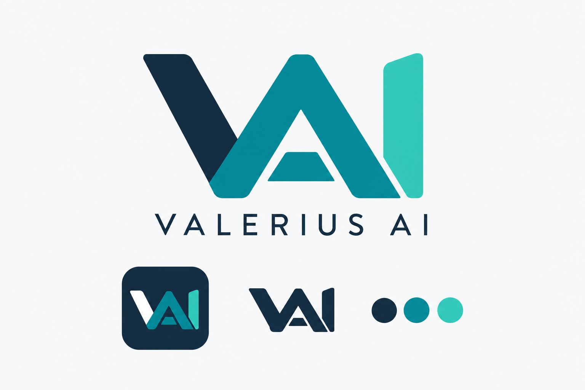

# Identidade visual do Valerius AI

Proposta aprovada por Guibson Valerio em 12/09/2026 para orientar a identidade visual e o logo do aplicativo.

## Referência aprovada

O monograma combina V de Valerius, A e I de Artificial Intelligence. A composição reúne a marca principal, uma aplicação em ícone e uma versão monocromática.

## Paleta de referência

| Cor | Hexadecimal | Uso previsto |
| --- | --- | --- |
| Azul profundo | `#132B40` | Base da marca, textos e fundos escuros |
| Turquesa escuro | `#087F8C` | Destaque principal |
| Turquesa claro | `#36C8B5` | Acento e diferenciação do I |
| Fundo claro | `#F5F7F8` | Apresentação em superfície clara |

Os códigos são os valores definidos para a proposta; a imagem gerada pode apresentar variações de pixels.

## Uso

Adotar este desenho e esta paleta como referência aprovada nas próximas aplicações da marca. Preservar a combinação das três letras, as proporções e a linguagem minimalista.

O PNG é uma prancha de apresentação gerada por IA, não um conjunto de arquivos finais de logo isolado. A preparação de versões vetoriais, transparentes e ícones em tamanhos específicos deve preservar o desenho aprovado e verificar a legibilidade em escala pequena.

Nesta etapa, somente a referência e estas orientações foram salvas. A interface e os ícones atuais do aplicativo não foram alterados.
